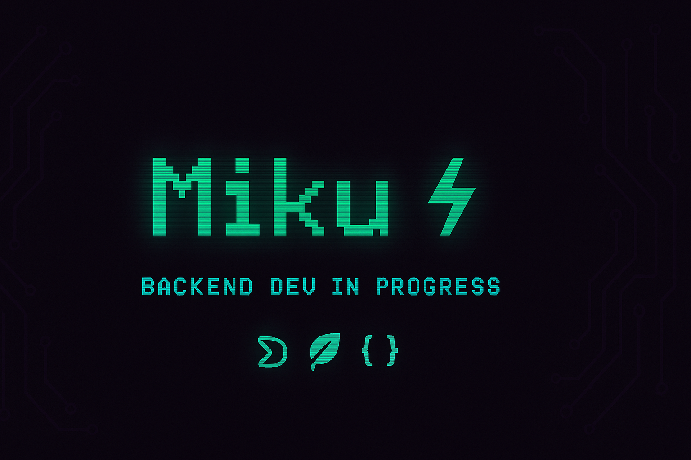
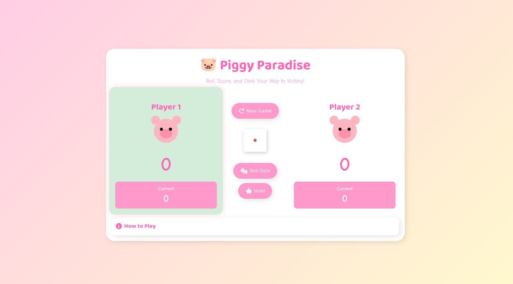
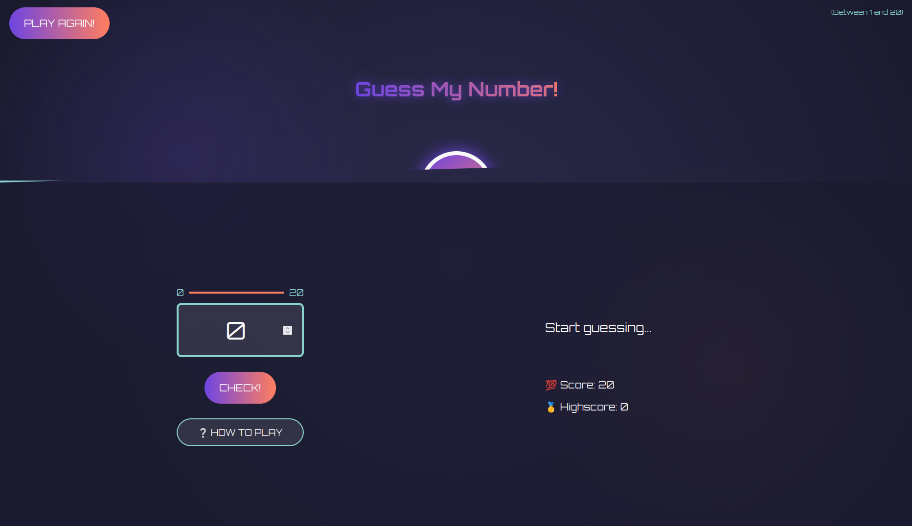

<h1><b>Yo, I'm </b><a href="https://github.com/megabytis">Miku ⚡</a> </h1>

  

 

&nbsp;***About me***

I’m a **BCA student** with a backend heart and a frontend spirit. Proudly Tier-3 raised, self-driven, and code-obsessed. Currently solving problems one repo at a time with `Node.js`, `MongoDB`, `C++`, and `JavaScript`.  
- 🔁 Building real-world CRUD apps with MERN  
- 🔐 Learning full-on JWT Auth and API security  
- 🤝 Open to cool collabs, OSS contributions, and internship gigs  
- 🎮 Gamer logic meets backend thinking  
- ☕ Runs on chai and Git pushes  
- 📫 Contact: <a href="warinmystar@gmail.com">warinmystar@gmail.com</a>

---

<!-- Terminal Skills Section -->
&nbsp; ***Skills***

###### Languages & Logic:

###### Backend:

###### Tools & Deployment:

---

<!-- Project Section -->
&nbsp;***Featured Projects***

<table>
<tr>
<td width="50%">
  <h3 align="center">Piggy Paradise 🐖</h3>
  

     
    
  

  
A quirky clicker game built with vanilla JS & DOM sorcery.

</td>
<td width="50%">
  <h3 align="center">Guess the Number 🎯</h3>
  

     
    
  

  
A minimal JS puzzle — guess, reset, replay. Simple & clean.

</td>
</tr>
</table>

---

<!-- GitHub Stats Section -->
&nbsp;***GitHub Stats***

 

  
   
  

---

<!-- Social Icons -->

  
  
  

---

<!-- Footer -->

  

