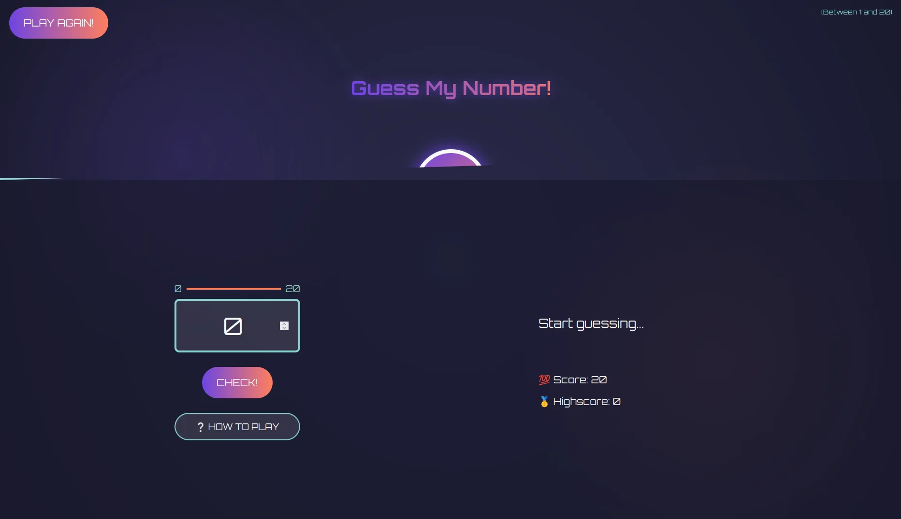
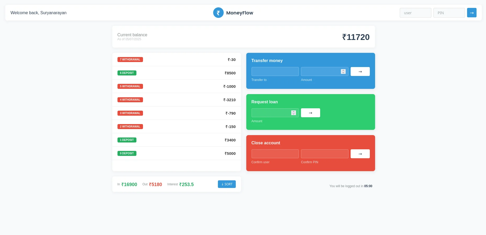

<h1 align="center">
  
  <b>Hey there, I'm Miku</b>
  
</h1>

  

<h3 align="center">
  <b>Backend Developer | Problem Solver | Tech Enthusiast</b>
</h3>

 

  

 

##  **About Me**

I'm a **BCA student** passionate about backend development and system design. My journey in tech is driven by curiosity and the desire to build efficient, secure systems.

- 🔭 Currently working on **MERN stack applications** with JWT authentication
- 🌱 Learning **microservices architecture** and **cloud deployment**
- 💡 Interested in **system design** and **database optimization**
- 🎯 2023 Goals: Contribute to **open-source** and master **Node.js internals**
- ⚡ Fun fact: I approach debugging like solving puzzle games
- 📫 How to reach me: [warinmystar@gmail.com](mailto:warinmystar@gmail.com)

 

##  **Tech Stack**

### Languages

### Backend

### Tools

 

## 🚀 Featured Projects

<!-- Project 1 -->

  
  <h3 style="margin: 1rem 0 0.5rem;">🐷 Piggy Paradise</h3>
  
Clicker game with vanilla JS and progressive scaling

  

    
    
  

<!-- Project 2 -->

  
  <h3 style="margin: 1rem 0 0.5rem;">🔢 Guess the Number</h3>
  
Interactive number guessing game with DOM manipulation

  

    
    
  

<!-- Project 3 -->

  
  <h3 style="margin: 1rem 0 0.5rem;">💸 MoneyFlow</h3>
  
Banking simulation with transaction history

  

    
    
  

 

##  **GitHub Stats**

  
   
  
   
  

 

##  **Let's Connect**

  
  
  

 

  

