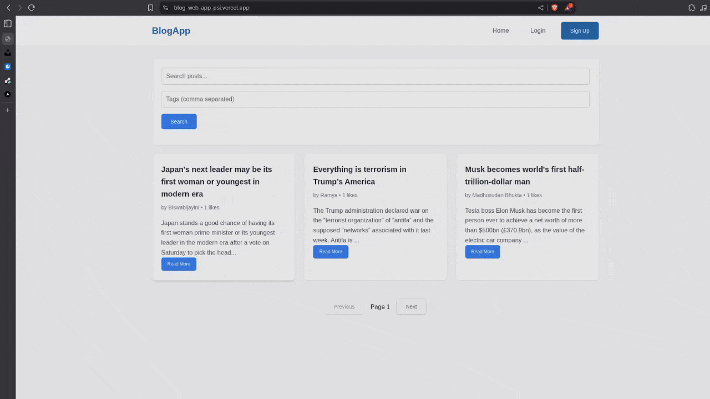
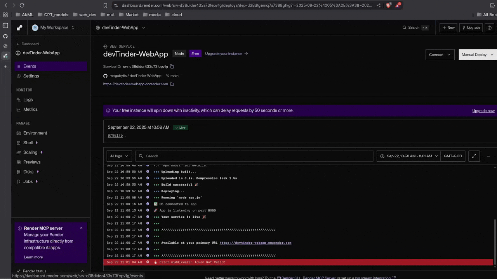

<h1 align="center">
  
  Hey, I'm <b>Madhusudan</b>
  
</h1>

  <b>Backend-Focused Full-Stack Engineer • Systems > CRUD • Always Shipping</b>

---

## ⚡ About Me

- Backend-first full-stack developer (Node.js, Express, MongoDB)
- Focused on **scalable backend architecture & real production concerns**
- Strong interest in **auth systems, caching, queues, cloud media, deployments**
- Believe in shipping first → then improving architecture
- Build projects that go **beyond tutorials & CRUD**

 

## 🛠 Tech Stack

### **Languages**

### **Backend & Infrastructure**

### **Frontend**

### **Dev & Deploy**

 

## 🚀 Featured Projects

### 🛒 **ShopNexus — Production-Style E-Commerce Platform**
**Backend-heavy flagship project**

- Session-based authentication (HttpOnly cookies, refresh-token driven)
- Strict RBAC (admin vs user separation)
- Domain-modeled backend (auth, products, cart, orders, admin)
- Redis caching for read-heavy & aggregation queries
- Rate limiting on sensitive endpoints
- Async background jobs using **BullMQ + Redis**
- Cloudinary image upload system (in-memory streaming, CDN-backed)
- Stripe checkout integration (test mode)
- Full order lifecycle + admin control panel
- Dockerized backend
- Deployed on **Vercel + Render + MongoDB Atlas**
- Live demo admin access for evaluators

  

 

### ✍️ **BlogWebApp — Full-Stack Blogging Platform**
- Role-based authentication
- Clean REST APIs
- Structured backend logic
- Production deployment

  

 

### 🤝 **DevTinder — Developer Matchmaking App**
- Auth + matchmaking logic
- Real-world interaction flows
- Scalable backend structure

  

 

## 🧠 What I Focus On
- Backend system design
- Auth, security & role isolation
- Performance (caching, DB efficiency)
- Async workflows (queues)
- Cloud-friendly architectures
- Shipping → measuring → improving

 

## 📊 GitHub Stats

  
  

 

## 🌐 Connect With Me

  
  
  

 

  

