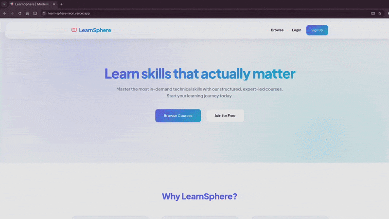

<h1 align="center">
  
  Hey, I'm <b>Madhusudan Bhukta</b>
  
</h1>

  <b>Backend Engineer • Node.js, Express & AI Systems Architecture • Systems > CRUD • Always Shipping</b>

---

## ⚡ About Me

- Backend Engineer with hands-on production experience building REST APIs and cross-service communication layers.
- Specialized in **Node.js, Express, Python FastAPI, MongoDB, and Redis performance optimization**.
- Architecting **GenAI workflows** — LangGraph multi-agent state machines, RAG pipelines, ChromaDB vector search, and hybrid retrieval.
- Experienced in production deployments on **AWS EC2** with **Docker Compose, Nginx reverse proxying, and SSL encryption**.
- Empirical performance mindset: systematic load profiling with **k6** to locate database and compute saturation limits.
- Believe in shipping clean, defensible code → measuring real bottlenecks → scaling architecture.

 

## 🛠 Tech Stack

### **Languages**

### **Backend & Infrastructure**

### **GenAI & Vector Search**

### **Cloud & DevOps**

 

## 🚀 Featured Projects

### 🤖 **Project KYH — AI Fitness Agent (Flagship)**
**Multi-Agent Health Coach Deployed on AWS Cloud Infrastructure**

- Architected an asynchronous multi-agent health coach using **LangGraph**, orchestrating **7 discrete graph nodes** and specialized subgraphs to isolate food intake parsing from macro calculation logic.
- Containerized and orchestrated split Node.js communication gateway and Python AI execution runtimes via **Docker Compose**.
- Deployed directly to a dedicated **AWS EC2** instance with custom domain mapping (`kyh.bhuktatech.in`), Nginx reverse proxying, and SSL encryption (Certbot).
- Implemented multi-day user session persistence using LangGraph checkpointing layers synced with MongoDB Atlas to track and evaluate behavioral nutrition trends over a 30-day window.

  

 

### 🛒 **ShopNexus — Production-Style E-Commerce Platform**
**Backend-Heavy Flagship E-Commerce Engine**

- Profiled live deployment thresholds under micro-burst concurrency using **k6**, executing **3,100+ requests** at a peak of **50 concurrent virtual users** to locate database bottlenecks and infrastructure compute constraints.
- Session-based authentication using JWT with refresh token rotation and HttpOnly cookies.
- Strict RBAC middleware protecting 25+ domain-modeled API routes (auth, products, cart, orders, admin).
- Redis caching layer for read-heavy query optimization and aggregation.
- Complete Stripe checkout, webhook confirmation, and refund processing lifecycle with idempotency handling.
- Deployed on **Vercel + Render + MongoDB Atlas**.

  

 

### 📄 **RAG-DocumentQnA — AI Document Search**
**Hybrid Search & Cross-Encoder Re-Ranking Engine**

- Built a dual-service architecture (Node.js API gateway + Python AI backend) supporting PDF, TXT, and DOCX document parsing with session isolation.
- Reduced LLM hallucinations by engineering a **Hybrid Search** engine combining dense vector embeddings (ChromaDB) with BM25 lexical keyword matching.
- Implemented a **Cross-Encoder re-ranker** pipeline to evaluate chunk relevancy score before context injection.

 

### 🎓 **LearnSphere — Full-Stack LMS with Payment Integration**

- JWT auth with refresh token flow + secure cookie handling.
- 3-tier RBAC — Student, Instructor, Admin with isolated route guards.
- Full course & lesson CRUD with free preview support.
- Stripe Checkout integration with webhook-based enrollment confirmation.
- Feature-based modular backend architecture (auth, course, lesson, payment).

  

 

## 🧠 What I Focus On
- Multi-Agent Graph Workflows (LangGraph, State Management)
- High-Concurrency Backend Architecture & API Contract Design
- Latency Profiling, Indexing, and Caching (k6, Redis, MongoDB)
- Containerized Cloud Deployments (Docker Compose, AWS EC2, Nginx, SSL)
- Hybrid Vector Search (BM25 + Dense Embeddings + Re-Ranking)

 

## 📊 GitHub Stats

  
  

 

## 🌐 Connect With Me

  
  
  
  

 

  

